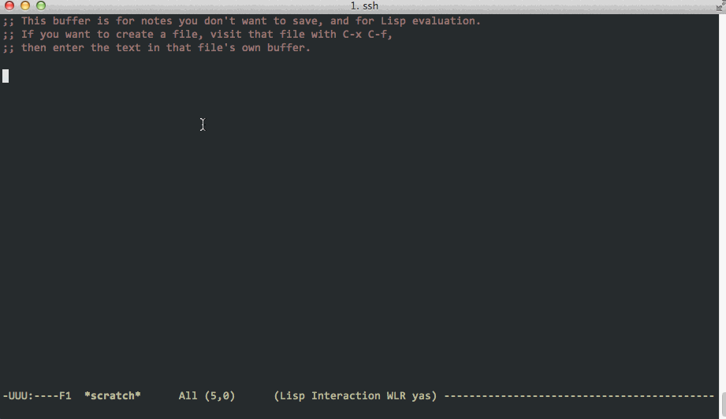

# hound.el
[](http://melpa.org/#/hound)

## Introduction
This is an emacs package to display [Hound](https://github.com/etsy/Hound) search results and quickly open the files.  If you've used [ag.el](https://github.com/Wilfred/ag.el) then its usage will be familiar to you (most of the compilation mode code is just slightly modified from ag.el). 


## Usage


Invoke hound at any time with ```M-x hound```.  Hound will try and be smart and pre-populate your query with whatever symbol is under the point.  It will then query the Hound server running at ```hound-host``` on port ```hound-api-point``` (customize these two variables to point to your Hound server).  Results are dumped into a compilation-mode buffer with a default directory of ```hound-root-directory``` (again, customize this to suit your project).  From here you can jump straight to the file and line number of the search results.

## Installation
The package is hosted on [MELPA](http://melpa.milkbox.net), so you can install it with
```
M-x package-install hound
```

## Configuration
There are a few variables that you should customize before this package will be useful.
* ```hound-host```: This is the hostname specifying where the Hound service is running. It's default is ```"localhost"```.
* ```hound-api-port```: The port number for the Hound service.  It's default is ```"6080"```.
* ```hound-repo-substitution```: The Hound API lowercases all the repo names, so this alist lets you map the lowercase repo name to the actual directory you've checked out the repo to locally. It will use the substitute name in the results buffer so that emacs can find the actual file.  It is an empty list by default.
* ```hound-root-directory```: This is the directory that contains all your repositories.  It's default is ```"~"```.
* ```hound-hit-face```: Customize this to change the color/presentation of matches in the results buffer.
* ```hound-resuse-window```: Non-nil means we open search results in the same window, hiding the results buffer. It's default is ```t```
